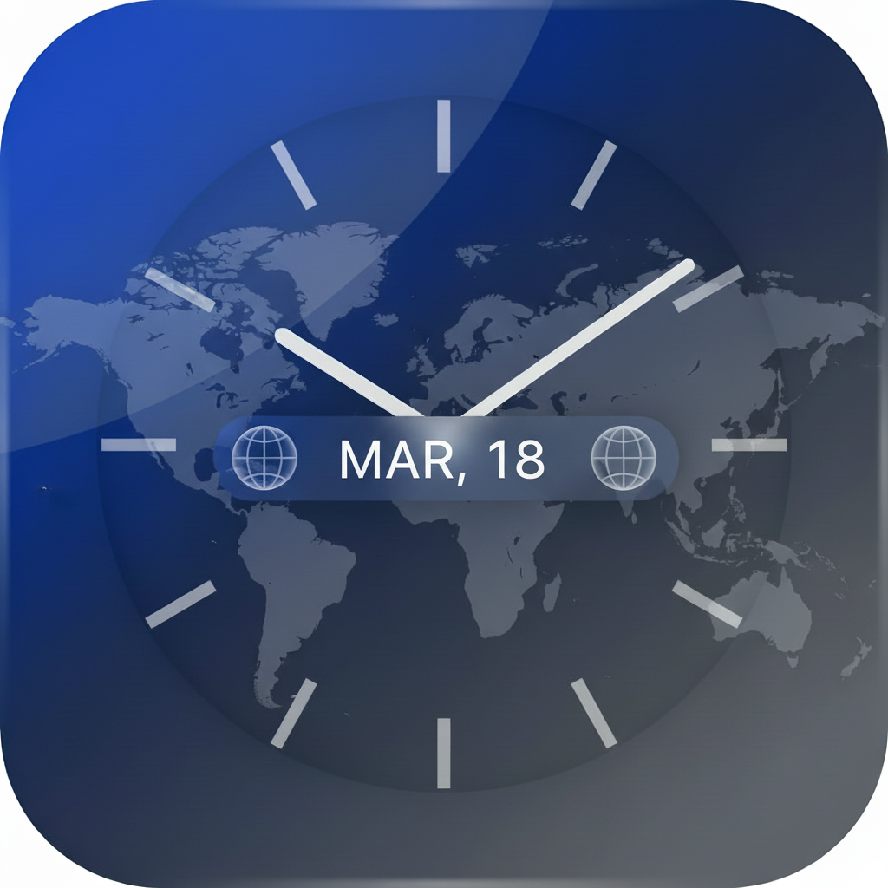

# Global Date Time

An iOS world clock app that displays the current date and time across multiple timezones, with home screen widgets and Dynamic Island Live Activity support.



---

## Features

- **World Clock List** — Add and manage multiple cities/timezones
- **Live Clock** — Time updates in real-time
- **12/24 Hour Toggle** — Switch time format in Settings
- **Date Display** — Shows the current date alongside the time for each timezone
- **Swipe to Delete / Reorder** — Manage your clock list easily

### Widgets
- **Small** — Single city with time and date
- **Medium** — Two cities side by side
- **Large** — Up to four cities stacked
- **Photo Slideshow** — Widget background cycles through your photos every 5 minutes, shuffles on screen unlock
- **StandBy Mode** — Optimized full-screen display when iPhone is charging

### Live Activity / Dynamic Island
- Shows current time in the Dynamic Island while the phone is locked
- Toggle on/off from Settings

---

## Requirements

- iOS 26.0+
- Xcode 26+
- [XcodeGen](https://github.com/yonaskolb/XcodeGen) — for project generation

---

## Project Structure

```
MultiDateTime/
├── project.yml                        # XcodeGen project spec
├── MultiDateTime/                     # Main app target
│   ├── MultiDateTimeApp.swift
│   ├── Models/
│   │   ├── ClockEntry.swift           # Core data model
│   │   ├── TimeFormat.swift           # 12h / 24h enum
│   │   └── LiveActivityAttributes.swift
│   ├── Services/
│   │   ├── ClockStore.swift           # State + App Group persistence
│   │   ├── TimezoneSearchService.swift
│   │   ├── LiveActivityService.swift
│   │   └── PhotoService.swift         # Fetches & saves photos to App Group
│   └── Views/
│       ├── ContentView.swift
│       ├── ClockListView.swift
│       ├── ClockRowView.swift
│       ├── LiveTimeText.swift
│       ├── AddTimezoneView.swift
│       ├── SettingsView.swift
│       └── AlbumPickerView.swift      # Album selection for widget photos
│
└── MultiDateTimeWidgets/              # Widget + Live Activity extension
    ├── Shared/
    │   └── SharedStore.swift          # Read-only App Group reader
    ├── Widgets/
    │   ├── MultiDateTimeWidget.swift
    │   ├── ClockTimelineProvider.swift
    │   ├── ClockTimelineEntry.swift
    │   ├── SmallWidgetView.swift
    │   ├── MediumWidgetView.swift
    │   └── LargeWidgetView.swift
    └── LiveActivity/
        ├── MultiDateTimeLiveActivity.swift
        ├── LockScreenView.swift
        ├── DynamicIslandCompactView.swift
        ├── DynamicIslandMinimalView.swift
        └── DynamicIslandExpandedView.swift
```

---

## Getting Started

### 1. Install XcodeGen
```bash
brew install xcodegen
```

### 2. Generate the Xcode project
```bash
cd MultiDateTime
xcodegen generate
```

### 3. Open in Xcode
```bash
open MultiDateTime.xcodeproj
```

### 4. Build & Run
Select your iPhone as the destination and hit **Run** (▶).

> **Note:** After each `xcodegen generate`, manually restore the entitlements files if they are cleared. This is a known XcodeGen behaviour with entitlements.

---

## Configuration

### Team ID
Set your Apple Developer Team ID in `project.yml`:
```yaml
DEVELOPMENT_TEAM: "GBQN4527HH"
```

### Bundle ID
The default bundle ID is `com.zzc.multidatetime`. Update in `project.yml` if needed:
```yaml
bundleIdPrefix: com.zzc
```

### App Group
Both targets share data via App Group `group.com.zzc.multidatetime`.
- Set in both `.entitlements` files
- Must be registered in the Apple Developer portal for full widget/Live Activity support

---

## Data Sharing

The main app and widget extension communicate via **App Group UserDefaults** and shared files:

| Key | Description |
|-----|-------------|
| `wc.entries` | JSON-encoded list of clock entries |
| `wc.timeFormat` | `"12h"` or `"24h"` |
| `wc.photoCount` | Number of saved widget photos |
| `wc.currentPhotoIndex` | Current photo index for slideshow |
| `wc.selectedAlbumIds` | User-selected album identifiers |

Photos are saved as JPEG files in the App Group container under `WidgetPhotos/`.

---

## Photo Slideshow

1. Open the app → grant Photos permission when prompted
2. Go to **Settings → Photo Albums** to select which albums to use
3. Favorite photos are always included first
4. If no favorites exist, falls back to photos from selected albums, then recent photos
5. Widget photo changes every **5 minutes** and also shuffles on **screen unlock**

---

## Distribution

| Method | Cost | Expiry |
|--------|------|--------|
| Direct install (USB) | Free | 7 days |
| AltStore sideload | Free | 7 days (auto-renews) |
| TestFlight | $99/year Apple Developer account | 90 days |
| App Store | $99/year Apple Developer account | Permanent |
